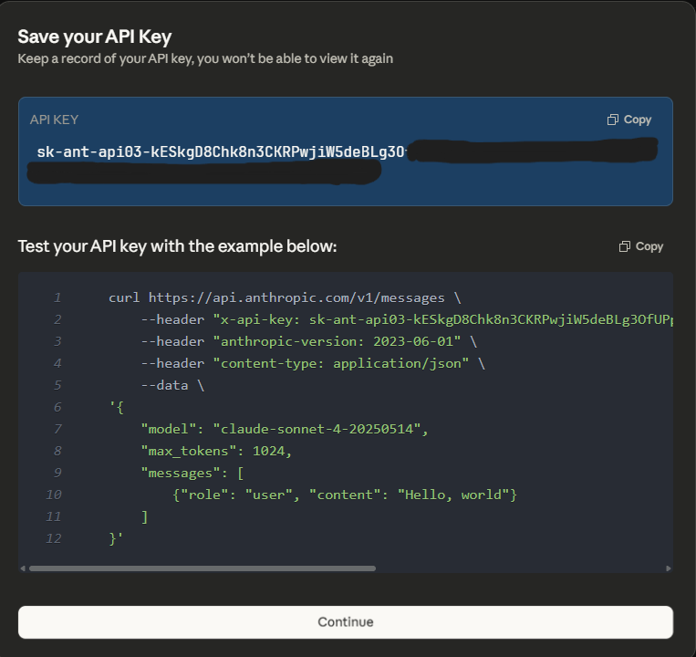

# Python AI Agent - Vejrudsigt

## Beskrivelse

Dette projekt er et eksempel på en simpel AI-agent, der er bygget med Python og LangGraph. Agenten bruger Anthropic's Claude 3 Sonnet model til at forstå en brugers anmodning om vejret og kan (i en udvidet version) slå den aktuelle vejrudsigt op for en given lokation.

Formålet er at demonstrere et grundlæggende agent-loop, hvor en AI-model kan tage imod input, beslutte sig for at bruge et værktøj (f.eks. et vejr-API) og returnere et svar til brugeren.

**Teknologier:**
*   Python
*   LangGraph & LangChain
*   Anthropic Claude API
*   `python-dotenv` til håndtering af API-nøgler

---

## 1. ALLERFØRSTE gang (kun én gang per projekt)

```bash
# Åbn projektet i VS Code fra Windows (som du plejer)
code .

# Åbn terminal i VS Code → vælg WSL: Ubuntu-24.04

# Opret virtuelt miljø (kun første gang!)
python3 -m venv .venv

# 2. Aktivér den (første gang – og alle fremtidige gange)
source .venv/bin/activate

# Installer alt det, projektet har brug for
pip install --upgrade pip
pip install langgraph langchain-core anthropic
pip install python-dotenv
```

## 2. HVER gang du åbner projektet igen ( om 6 måneder)

```bash
# Åbn projektet i VS Code (code . fra Windows)

# Åbn terminal → vælg WSL: Ubuntu-24.04

# Aktivér miljøet (det eneste, du SKAL huske!)
source .venv/bin/activate

# Herefter virker alt: pip, python, vscode extensions osv.
```

## 3. Hvis du får “command not found” eller mærkelige fejl

```bash
# Tjek at du er i det rigtige miljø
which python
# → skal pege på noget inde i mappen .venv/bin/python

# Hvis ikke → vælg interpreter i VS Code:
Ctrl+Shift+P → "Python: Select Interpreter" → vælg .venv/bin/python
```

## 4. Opdater pakker

```bash
# Tilføj ny pakke
pip install noget-fedt-pakke

# Gem altid ændringerne til requirements.txt
pip freeze > requirements.txt
```

## 5. Bonus kommandoer (copy-paste venlige)

```bash
# Hurtig aktivering (tilføj til ~/.bashrc hvis du vil have alias)
source .venv/bin/activate

# Kør hovedscript
python agent_anthropic.py

# Deaktiver miljø igen (valgfri)
deactivate
```

## TL;DR – den 10-sekunders huskeliste

1. `code .` (fra Windows)
2. Terminal → vælg WSL Ubuntu-24.04
3. `source .venv/bin/activate`
4. `python main.py`

## venv cleanup

````bash
deactivate
rm -rf .venv
````

## hent key

````bash
https://console.anthropic.com/dashboard

https://console.anthropic.com/workbench/841f8060-32e1-47e0-9b48-5a2a41b5eaa5

https://github.com/anthropics/claude-cookbooks
`````
## claude prompt


## key page



## test af key

````bash
>input

curl https://api.anthropic.com/v1/messages \
        --header "x-api-key: ANTHROPIC_API_KEY" \
        --header "anthropic-version: 2023-06-01" \
        --header "content-type: application/json" \
        --data \
    '{
        "model": "claude-sonnet-4-20250514",
        "max_tokens": 1024,
        "messages": [
            {"role": "user", "content": "Hello, world"}
        ]
    }'

>output:
    {"model":"claude-sonnet-4-20250514","id":"msg_01QC5c2wd7P7AG6wx4p2QC6f","type":"message","role":"assistant","content":[{"type":"text","text":"Hello! Nice to meet you. How are you doing today? Is there anything I can help you with?"}],"stop_reason":"end_turn","stop_sequence":null,"usage":{"input_tokens":10,"cache_creation_input_tokens":0,"cache_read_input_tokens":0,"cache_creation":{"ephemeral_5m_input_tokens":0,"ephemeral_1h_input_tokens":0},"output_tokens":25,"service_tier":"standard"}}
````


## agent output

````bash
# default by er Aalborg

> python3 agent_anthropic.py

=== FØRSTE RESPONS ===
Stop reason: tool_use
Content: [TextBlock(citations=None, text='Jeg vil hente de aktuelle vejrdata for Aalborg for dig.', type='text'), ToolUseBlock(id='toolu_01Ru3wyN6nd9LJn2C1xDa6se', input={'city': 'Aalborg'}, name='get_weather', type='tool_use')]

=== TOOL CALL: get_weather ===
Input: {'city': 'Aalborg'}
Result: {'city': 'Aalborg', 'temperature': 1.8, 'wind_speed': 8.6, 'weather_code': 1}

=== ENDELIGT SVAR ===
Her er en kort opsummering af vejret i Aalborg i dag:

**Vejret i Aalborg:**
- **Temperatur:** 1,8°C
- **Vindhastighed:** 8,6 m/s
- **Vejrforhold:** Hovedsageligt klart (vejrkode 1 indikerer klart eller næsten klart vejr)

Det er altså ret koldt i Aalborg i dag med temperaturer lige over frysepunktet, og der er en del vind. Vejret er dog pænt med hovedsageligt klar himmel.


# eller med input

> python3 agent_anthropic.py aarhus

=== FØRSTE RESPONS ===
Stop reason: tool_use
Content: [TextBlock(citations=None, text='Jeg henter vejroplysningerne for Aarhus for dig.', type='text'), ToolUseBlock(id='toolu_014oz8AMykpJPzJrtEXM2J9y', input={'city': 'Aarhus'}, name='get_weather', type='tool_use')]

=== TOOL CALL: get_weather ===
Input: {'city': 'Aarhus'}
Result: {'city': 'Aarhus', 'temperature': 1.8, 'wind_speed': 14.4, 'weather_code': 1}

=== ENDELIGT SVAR ===
Her er en kort vejroversigt for Aarhus i dag:

**Vejret i Aarhus:**
- **Temperatur:** 1.8°C
- **Vindhastighed:** 14.4 km/t
- **Vejrforhold:** Overvejende klart (vejrkode 1)

Det er altså en kølig dag med let frost, moderat vind og overvejende klart vejr. Husk at klæde dig varmt på, hvis du skal ud!
````
